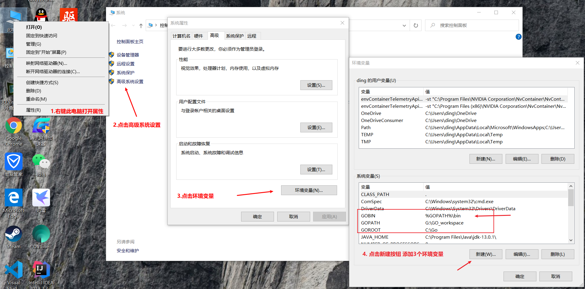
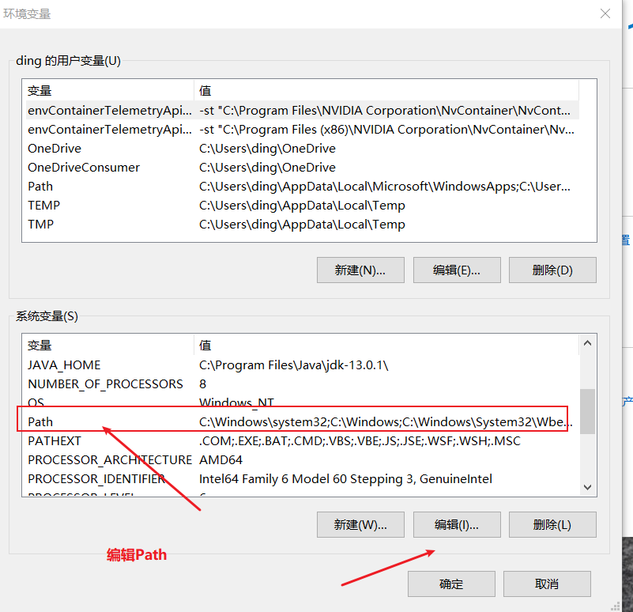
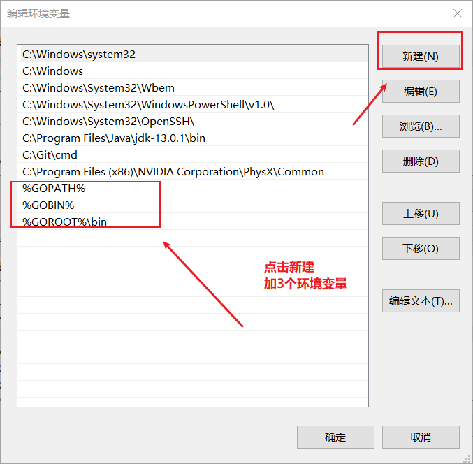
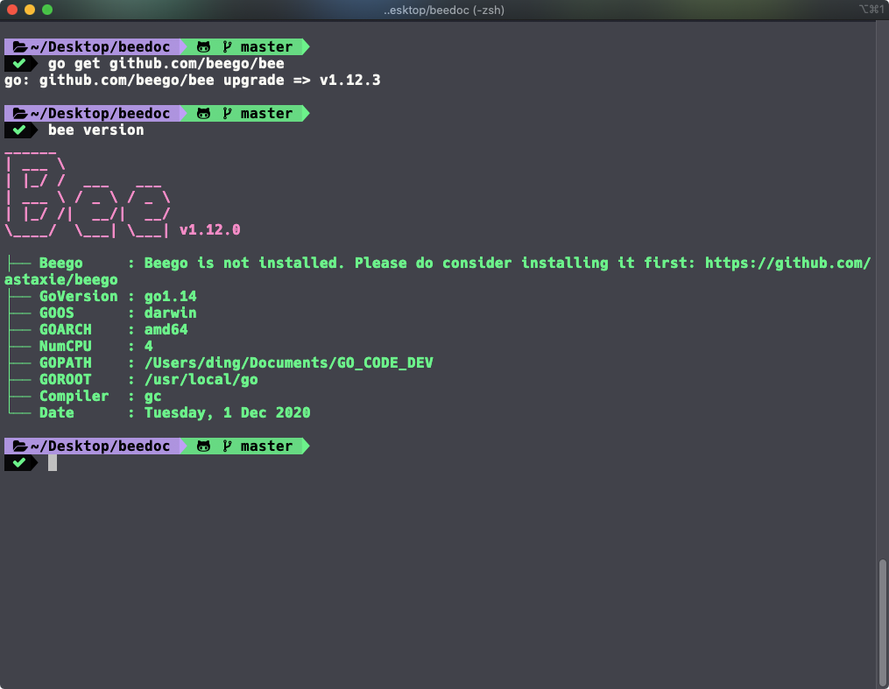

## bee 工具在Mac和Linux环境配置

`bee` 工具首先它是依赖于Go的环境的，所以我们在安装`bee`工具之前请确保你已经安装了`Go`，如果没有安装请在下面网站打开并且安装`Go`到你的计算机中。

- Go的官方网站: https://go.dev 或 https://golang.org

在安装完成之后你需要把你的`go`添加到环境变量中，以下是一个完整的环境配置例子可供参考，支持`Linux`和`Mac`

- Mac环境配置是`~/.bashrc`或`~/.bash_profile`文件中
- 如果你使用了`Zsh` 那么就是`~/.zshrc` 文件中
- Linux的环境配置还可能在`/etc/profile` 文件中

如果你不确定自己用的是什么`shell`，可以运行`echo $SHELL`进行查看。

``` bash
#go语言安装主根目录
export GOROOT=/usr/local/go #替换你的目录
#GOPATH 是自己的go项目路径，自定义设置
export GOPATH=/Users/ding/go_workspace #替换你的目录
#GOBIN 当我们使用go install命令编译后并且安装的二进制程序目录
export GOBIN=$GOPATH/bin
# 启用 Go Modules 功能
export GO111MODULE=on
# 配置 GOPROXY 环境变量。你可以换成你喜欢的 proxy
export GOPROXY=https://goproxy.cn,direct
# 加入环境变量中
export PATH=$PATH:$GOROOT/bin:$GOBIN
```

添加以上内容到你环境配置文件中，并保存，执行`source ~/.zshrc`命令刷新环境变量。

## bee 工具在Windows10环境配置

在`Windows10`的配置部署是:`此电脑->属性->高级系统设置->环境变量`





## bee 安装和测试是否安装成功

在你的终端里执行下面命令安装`bee`工具：

`go get -u github.com/beego/bee/v2`

然后执行`bee version`查看是否安装成功：



如果有类似提示信息说明安装成功。
