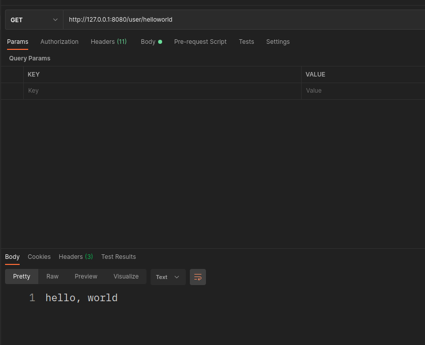

# 注册路由

在 Beego 里面注册路由很简单：

```go
package main

import "github.com/beego/beego/v2/server/web"

type UserController struct {
	web.Controller
}

func (u *UserController) HelloWorld()  {
	u.Ctx.WriteString("hello, world")
}

func main() {
	web.AutoRouter(&UserController{})
	web.Run()
}
```

当我们访问 URL `http://127.0.0.1:8080/user/helloworld`的时候，可以看到结果：



## AutoRouter

刚才我们使用的是`web`模块里面一个很实用的注册路由的方法`AutoRouter`。时常让我们感到困惑的是，当我使用`AutoRouter`的时候，注册出来的路径是什么呢？

`AutoRouter`解析出来的路由规则由`RouterCaseSensitive`的值，`Controller`的名字和方法名字共同决定。

其中`UserController`它的名字是`User`，而方法名字是`HelloWorld`。那么：
- 如果`RouterCaseSensitive`为`true`，那么`AutoRouter`会注册两个路由，`/user/helloworld/*`，`/User/HelloWorld/*`；
- 如果`RouterCaseSensitive`为`false`，那么会注册一个路由，`/user/helloworld/*`；

总而言之，在使用`AutoRouter`的情况下，使用全小写的路径总是没错的。

## AutoPrefix

## 相关内容
[如何查看我注册的路由信息](router_tree.md)